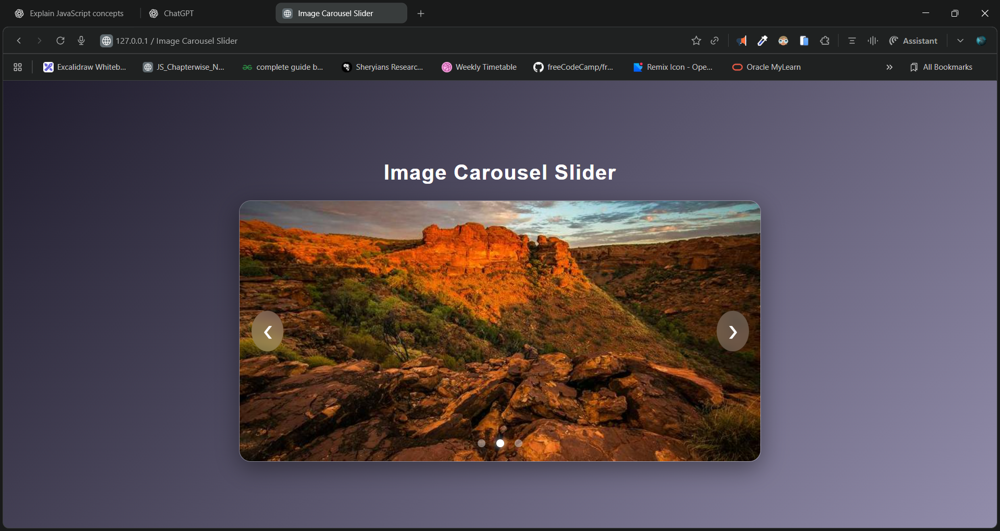

# 🖼️ Image Carousel Slider

A sleek, modern, and fully responsive **Image Carousel Slider** built using **HTML**, **CSS**, and **JavaScript**.
This component features smooth fading transitions, interactive navigation arrows, and clickable dots — all wrapped inside a beautiful glass-morphism UI.

---

## 🔗 Live Demo

👉 **Live Website:** [https://dileep-kumawat.github.io/Image-Carousel-Slider-using-html-css-and-js/](https://dileep-kumawat.github.io/Image-Carousel-Slider-using-html-css-and-js/)

---

## 🎥 Demo Video

👉 [click to watch](./demo.mp4)

---

## 🖼️ Project Preview



---

## 🚀 Features

✔ Smooth fade-in transition between slides
✔ Auto-slide every 3 seconds
✔ Manual navigation with **Previous** & **Next** buttons
✔ Clickable dots to jump to any slide
✔ Modern **glassmorphism** UI
✔ Fully responsive design
✔ Lightweight — No external libraries

---

## 📂 Project Structure

```
📁 Image Carousel Slider
├── index.html
├── style.css
└── script.js
```

---

## 🛠️ Technologies Used

* **HTML5**
* **CSS3 (Glassmorphism + Responsive design)**
* **Vanilla JavaScript**

---

## 📜 How It Works

### JavaScript functionality includes:

* Tracking active slide
* Auto-playing slides every 3 seconds
* Restarting timer on manual interaction
* Updating dot indicators accordingly

Example logic:

```js
showSlide(index);
currentSlide = index;
setInterval(() => {
   nextSlide();
}, 3000);
```

---

## ▶️ Usage

Just open **index.html** in your browser — everything works instantly.
No build tools, no dependencies.

---

## 📦 Installation (Optional)

```bash
git clone https://github.com/Dileep-kumawat/Image-Carousel-Slider-using-html-css-and-js.git
cd image-carousel-slider
open index.html
```

---

## 🤝 Contributing

Contributions, issues, and feature requests are welcome!
Feel free to fork and improve the carousel.

---

## ⭐ Show Your Support

If you like this project, give it a ⭐ on GitHub!

---

## 🧑‍💻 Author

Made with ❤️ by **Dileep kumawat**
- 📧 [dileepkumawat525@gmail.com](mailto:dileepkumawat525@gmail.com)
- 🔗 [LinkedIn](https://www.linkedin.com/in/dileep-kumawat/)

---